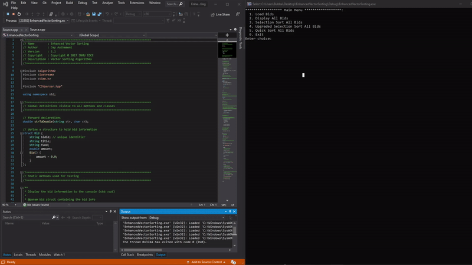
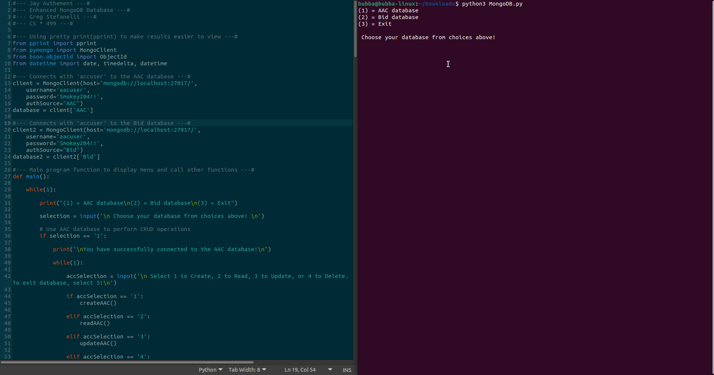

# Code Review
### Reviewing previous projects and discovering ways to enhance them

&nbsp;&nbsp;&nbsp;&nbsp;&nbsp;&nbsp;The video above is a code review, performed by me on three seperate projects that were completed throughout my courses at Southern New Hampshire University. This initial review was designed to find any flaws in these previous assignments and use the different skills that I have acquired throughout my time at SNHU to enhance each project. The results of this code review have led to updated versions of each project, which are linked and described below.

# Pi Weather Station
### Software Design and Engineering

&nbsp;&nbsp;&nbsp;&nbsp;&nbsp;&nbsp;The Pi Weather Station project is a weather monitoring program created with a Raspberry Pi 4 computer, the Python programming language, and a GrovePi hardware kit purchased from Dexter Industries. It's purpose is to continuously collect temperature and humidity data from a sensor and output all the gathered information to a JSON file once the program is stopped. The purpose of the JSON file is for data manipulation, which the user can use to create charts, trends, reports, or any other means of displaying the data. There are LED's connected as well that show the user exactly what the current weather conditions are based on what colors are illuminated at the time. The Pi Weather Station will even shutdown at night, once the attached light sensor no longer detects sunlight and meets a pre-determined threshold limit.

&nbsp;&nbsp;&nbsp;&nbsp;&nbsp;&nbsp;As an opportunity to showcase my skills and abilities in software design and engineering, the Pi Weather Program has since been enhanced and upgraded to version [1.1.0]. With this update comes two new features that have been added in the form of new Python functions. These functions give the machine a startup and shutdown sequence, so now when the Pi Weather Station is booted up a startup sequence runs which displays a welcome message to the user and flashes the green LED two times, indicating it is in startup mode. When the program is shut-down, the shut-down sequence runs and blinks the red LED twice while displaying a shut-down message. The LCD screen was also included in this update, which now will display a startup and shutdown message to the user while running the function. To consider this project complete, variables were renamed to better reflect their purpose in the code, such as the variable 'blue' getting changed to 'tempOutputPort' or the variable 'grLed' getting changed to 'greenLED'. These software design changes may seem small, but will aid in future debugging and updates.

&nbsp;&nbsp;&nbsp;&nbsp;&nbsp;&nbsp; The original scenario for this assignment was to continuously build upon features in each sprint for a stakeholder who's requirements would constantly change. As a developer, it was my job to produce a product that the client was happy with, which would eventually become the Pi Weather Station. Adding the new features to the program was fairly straight forward, but required a thorough understanding of how Python defines functions, performs loops, and interacts with the GrovePi hardware. That is why this particular project was chosen to enhance and use for my comprehension of software design. The code performs every task desgined as intended, such as gathering data from the correct port and outputting it to the JSON file or lighting the correct LED for the correct amount of time. The enhancements added in v[1.1.0] attest to this comprehension and leads to a stronger weather station program. Coding best practices were used and I believe it shows through the completeness of this project.

&nbsp;&nbsp;&nbsp;&nbsp;&nbsp;&nbsp;Below is a link to the GitHub repository that contains the newly enhanced program along with the original for comparison. 

[Pi Weather Station Repository](https://github.com/formulagp/Pi-Weather-Station)

# Upgraded Vector Sorting
### Algorithm Design / Structure

&nbsp;&nbsp;&nbsp;&nbsp;&nbsp;&nbsp;The second project presented here is a program that was specifically created to show how some of the more commonly used algorithms in the computer science industry are created and used. This program is written in C++ and begins by presenting the user with a menu of options including load bids, display bids, perform selection sort on bids, perform upgraded selection sort on bids, perform quicksort on bids, or exit the program. In the original program, v[1.0.0], the only algorithms available for use were the selection sort and the quick sort function. In v[1.1.0], the upgraded selection sort function was added. When any one is chosen, the algorithm will run on the loaded data and sort each element by name. The program will then display the time it took to successfully sort the data after running, given in clock ticks and seconds. This allows the user to actually see how the algorithms compare in performance to accomplish the same task. To verify the sorts were completed successfully, the user then has the ability to choose display bids again and see that the elements are now in a sorted order.

&nbsp;&nbsp;&nbsp;&nbsp;&nbsp;&nbsp;This project was chosen to display my comprehension of algorithm design and structures, as it's sole purpose is strictly to run created algorithms on a set a data that is provided. To go a step further with this assignment, the [1.1.0] update adds in a completely new algorithm, not originally in the program. A modified version of the selection sort was implemented, known as the upgraded selection sort method. This new algorithm sorts the elements by first going through and finding the minimum and maximum values of the entire array. Next, they are placed at the very beginning and end of the array. For the next loop through, these two elements are disregarded and the loop begins at the second element, array[1], and ends on the second to last element, myArray[n-1], before swapping the elements found again. This process will continue until the entire array is gone through, leaving a sorted array that is techincally quicker than the standard original sort. Another fix performed in v[1.1.0] of this program was changing the integer data type for the user's menu input, to the character type with a defined default case for the switch input. This remedies the problem of the user entering an unexpected value, causing unexpected system behavior. One final code cleanup has also removed an unused method that was not required for this program.

&nbsp;&nbsp;&nbsp;&nbsp;&nbsp;&nbsp;The problem with integrating a new method, especially an algorithm, is making sure that all data input required to perform the actual sort match. This program originally created a vector to house all the elements from the CSV file, so pulling this data for use with the new upgraded selection algorithm was simple. The hardest part of implementing this algorithm was mentally picturing how the loops are occuring to properly write the code necessary. It's very easy to get lost while trying to understand exactly what part of the loop needs to increment or decrement, which is why drawing out exactly what the code is doing line by line can help see what step is performing what. Understanding how the loop is supposed to work may be easy, but actually designing it to work with a previously created program proved quite difficult. 

&nbsp;&nbsp;&nbsp;&nbsp;&nbsp;&nbsp;The link below contains the Github repository that includes the enhanced program with the upgraded selection sort function, along with the original program for comparison purposes.

[Upgraded Selection Sort Repository](https://github.com/formulagp/Upgraded-Selection-Sort)

# MongoDB Database
### Database Design

&nbsp;&nbsp;&nbsp;&nbsp;&nbsp;&nbsp;Finally, the MongoDB Database project displayed above is a project that was originally created to help learn database development and how to create the programs that can interact with the database to perform CRUD(Create, read, updatem and delete) operations on. For version [1.0.0] of this project, a database was imported into MongoDB from the provided aac_shelter_outcomes.csv file. After, a login and password were created within the MongoDB command shell that allows the user to log into the database and perform these CRUD operations. Once these two critical components were created, the next step was creating the CRUD functions that would manipulate the data contained inside the database. The functions created include 'createAAC', 'readAAC', 'updateAAC', and 'deleteAAC'. Once the user is brought to this menu, they can choose any of the CRUD options which will then prompt them to enter their new information for the element. If an element they wish to change does not exist, the program will verify and display a message to the user to try again with a correct input.

&nbsp;&nbsp;&nbsp;&nbsp;&nbsp;&nbsp;This chosen artifact is a perfect working example to show my comprehension of not only database creations, but also the creation of programs to 'stack' onto MongoDB and perform CRUD operations on the data that they contain. The orignal program in version[1.0.0] is an excellent example, but to go a step further the program was updated to version[1.1.0], which introduces an extra database, user login, and accompanying CRUD functions to the mix. To start, a new database was created in MongoDB by importing in a completely new .CSV file, eBid_Monthly_Sales.CSV. Once imported within the MongoDB command shell, a new user was created that allows read and write access to the database. This database name and user login was then added into the original MongoDB Database Python program. To consider this enhancement successful, I wanted the user to be able to log back and forth into either database of their choice, without any complications. To accomplish this task a new client was coded into the Python program, 'client2', with all the necessary components to properly log the user in, such as the username and passowrd. To switch back and forth between databases, a new menu was creaeted that takes user input to decide which datbase they wish to use. Once chosen, a successful login message will appear showing that the user is now logged into their database of choice, which then brings up the CRUD option menu. The user can now input their choice again to either create, read, update, or delete any of the elements within the database. To make the program function properly and perform CRUD operations on the second database that was created, all new CRUD functions had to be designed that allowed interaction between the data contained in the second database. These functions include 'createBid()', 'readBid()', 'updateBid()', and 'deleteBid()'. Once finished their work, the user can exit the CRUD option menu to chose another database and start over. If not, the user may select exit to properly shutdown the program.   

&nbsp;&nbsp;&nbsp;&nbsp;&nbsp;&nbsp;The biggest hurdle when creating this enhanced update was getting the login for the second database correct. Many times, the program would log the user in to the database of their choice, but would not properly log out and login to the next database. This was eventually overcome by creating a completely new client in the Python code that would strictly connect to the second database. After creating this, the program worked as intended and allowed the user to freely switch back and forth between databases, while giving them the correct secondary menu for the appropriate CRUD options. With this first issue came another issue that would not use the correct CRUD menu, such as logging into the AAC database, but still using the CRUD functions developed for the Bids database. Again, this issue was corrected by properly creating a second user login for the Bids database. Pushing past these complications has led to the development of an enhanced program that can freely interact with MongoDB databases.

&nbsp;&nbsp;&nbsp;&nbsp;&nbsp;&nbsp;Below is the link to this project's repository, where the program can be downloaded. It also contains the original program before the enhancements as well for comparison purposes.

[MongoDB Database Repository](https://github.com/formulagp/MongoDB-Database)

#

[About me](about.md)
